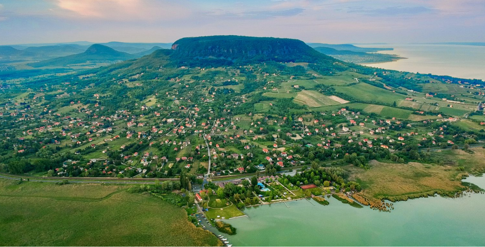
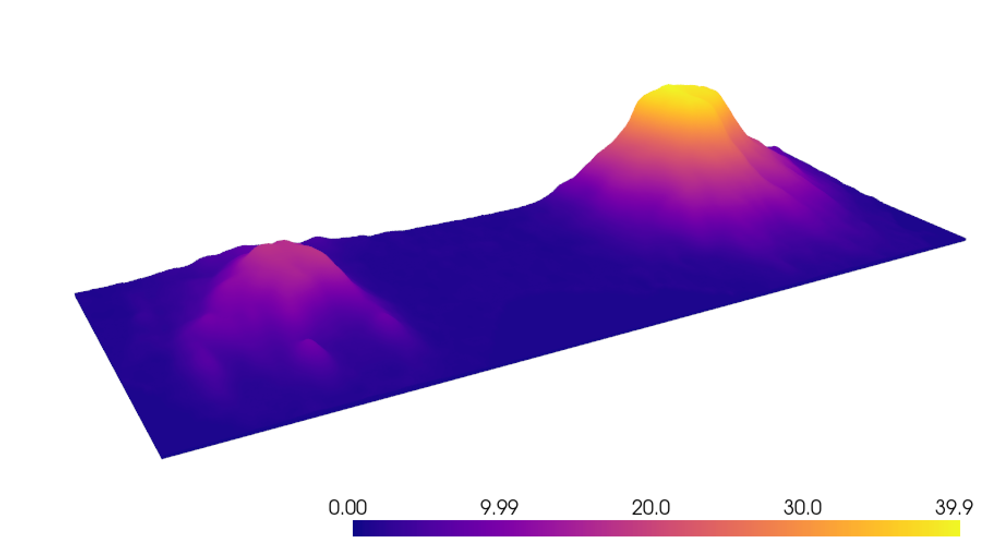

# How to make digital elevation maps in Python?

I thing you guys are very excited for this.
The notebook in the repo solves the problem of getting from here

to here

## Requirements

- Python >= 3.10
- Basic Python knowledge

## Resources

- <https://opentopography.org/>
- <https://ngmdb.usgs.gov/topoview/viewer/#4/40.01/-100.06>
- <https://maps.equatorstudios.com/>
- <https://touchterrain.geol.iastate.edu/>
